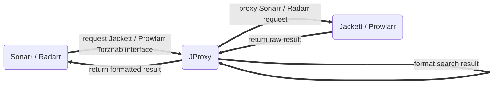

<p align="center">
  <a href="https://github.com/LuckyPuppy514/jproxy">
    
  </a>
</p>
<p align="center">
  <a href="https://github.com/LuckyPuppy514/jproxy"></a>
  <a href="https://github.com/LuckyPuppy514/jproxy"></a>
  <a href="https://github.com/LuckyPuppy514/jproxy/blob/main/LICENSE.txt"></a>
</p>

<div align="center">
  <a href="https://github.com/LuckyPuppy514/jproxy/blob/main/README.md">简体中文</a> | English
</div>

- [🌟 Introduce](#-introduce)
- [🧱 Install](#-install)
  - [Docker](#docker)
  - [Windows](#windows)
- [☃️ Basic Configuration](#️-basic-configuration)
- [😘 Contributing](#-contributing)
- [👏 Related Efforts](#-related-efforts)
- [🃏 License](#-license)

## 🌟 Introduce

A proxy between `Sonarr / Radarr` and `Jackett / Prowlarr`, mainly used to optimize search and improve recognition rate




## 🧱 Install

### Docker

```text
version: '3.0'
services:
   jproxy:
      image: luckypuppy514/jproxy:latest
      container_name: jproxy
      restart: unless-stopped
      environment:
      - PUID=1000
      - PGID=1000
      - TZ=Asia/Shanghai
      - JAVA_OPTS=-Xms512m -Xmx512m
      ports:
      - 8117:8117
      volumes:
      - /docker/jproxy/database:/app/database
```

If you want deploy via `docker run` ，see [docker-run.sh](https://github.com/LuckyPuppy514/jproxy/blob/main/docker/docker-run.sh)

|   Parameter   |      Default      |                                                    Description                                                     |
| :-----------: | :---------------: | :----------------------------------------------------------------------------------------------------------------: |
|     PUID      |         0         |                                                      User ID                                                       |
|     PGID      |         0         |                                                      Group ID                                                      |
|      TZ       |   Asia/Shanghai   |                                                      Timezone                                                      |
|   JAVA_OPTS   | -Xms512m -Xmx512m |                                                   JVM parameters                                                   |
| CACHE_EXPIRES |       4320        |                                          Cache expiration time (minutes)                                           |
| TOKEN_EXPIRES |       10080       |                                          Login expiration time (minutes)                                           |
| SYNC_INTERVAL |         3         |                                         Synchronization interval (minutes)                                         |
|  RENAME_FILE  |       true        |                                          File rename switch (true/false)                                           |
|   MIN_COUNT   |         8         | Append primary title (without season and episode number) to search while current result count less than this value |

If you need to set a proxy, you can append the corresponding proxy parameters in `JAVA_OPTS`

- HTTP Proxy
  `-Xms512m -Xmx512m -Dhttp.proxyHost=192.168.6.2 -Dhttp.proxyPort=12345`
- SOCKS Proxy
  `-Xms512m -Xmx512m -DsocksProxyHost=192.168.6.2 -DsocksProxyPort=54321`

### Windows

1. [Download jdk17](https://kutt.lckp.top/yrnerc), install and configure environment variables
2. [Download windows.zip](https://github.com/LuckyPuppy514/jproxy/releases) ，unzip to the installation directory

|      Filename      |        Explanation        |                 Remark                  |
| :----------------: | :-----------------------: | :-------------------------------------: |
|    startup.bat     |       starup script       |                    -                    |
|    shutdown.bat    |      shutdown script      |                    -                    |
| startup-daemon.bat | startup background script | hidden window running in the background |
|      database      |         database          |          keep it while upgrade          |
|       config       |    configuration files    |                    -                    |
|     jproxy.jar     |   Runnable jar package    |                    -                    |

## ☃️ Basic Configuration

- URL: `http://127.0.0.1:8117/login`
- User: `jproxy`
- Password: `jproxy@2023`


① Fill in `Sonarr Server Url`, `API KEY`, and `Indexer Address` in `System -  Configure` (Jackett or Prowlarr)


💡 After saving, it should normally be as shown in the picture below ✅, otherwise please check the input and network connectivity


② For the first use, it is recommended to manually synchronize `Series Title` and `Series Rule` once (it will be automatically synchronized later)


③ In `Sonarr - Indexers`, modify the `IP` and `Port` of the indexer `URL` to the `IP` and `Port` of JProxy, and append the path `/sonarr/jackett` (Prowlarr should append with `/ sonarr/prowlarr`)

`http://192.168.6.15:9117/api/v2.0/......` ➡️ `http://192.168.6.14:8117/sonarr/jackett/api/v2.0/......`
  


💡 It is recommended to modify one first, and then modify other indexer configurations after confirming that it is normal


[🎗️ For advanced configuration and usage, see wiki](https://github.com/LuckyPuppy514/jproxy/wiki)

## 😘 Contributing

Feel free to dive in！[Open an issue](https://github.com/LuckyPuppy514/jproxy/issues/new/choose) or submit PRs.

- [arco-design-pro-vue](https://github.com/arco-design/arco-design-pro-vue)
- [spring-boot](https://github.com/spring-projects/spring-boot)
- [sqlite](https://github.com/sqlite/sqlite)
- [liquibase](https://github.com/liquibase/liquibase)
- [mybatis](https://github.com/mybatis/mybatis-3)
- [mybatis-plus](https://github.com/baomidou/mybatis-plus)
- [caffeine](https://github.com/ben-manes/caffeine)
- [knife4j](https://github.com/xiaoymin/knife4j)
- [charon](https://github.com/mkopylec/charon-spring-boot-starter)
- [jib](https://github.com/GoogleContainerTools/jib)

## 👏 Related Efforts

- [Sonarr](https://github.com/Sonarr/Sonarr)
- [Radarr](https://github.com/radarr/radarr)
- [Jackett](https://github.com/Jackett/Jackett)
- [Prowlarr](https://github.com/Prowlarr/Prowlarr)
- [qBittorrent](https://github.com/qbittorrent/qBittorrent)

## 🃏 License

[MIT](https://github.com/LuckyPuppy514/jproxy/blob/main/LICENSE) © LuckyPuppy514
