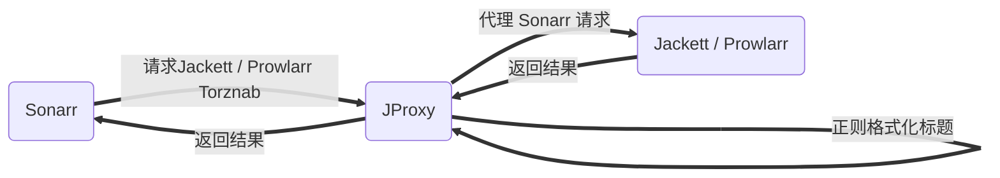

# Jackett / Prowlarr 代理

支持的运行环境：docker, linux, windows，推荐：dokcer  

本项目包含以下功能：
> 代理 jackett / prowlarr Torznab 接口，利用正则格式化返回结果中的标题，从而使 sonarr 识别，主要是针对动漫



## 内容列表

- [Jackett / Prowlarr 代理](#jackett--prowlarr-代理)
  - [内容列表](#内容列表)
  - [背景](#背景)
  - [安装](#安装)
    - [Docker（推荐）](#docker推荐)
      - [docker-compose](#docker-compose)
      - [docker run](#docker-run)
    - [Linux / Windows](#linux--windows)
  - [使用说明](#使用说明)
  - [简单演示效果](#简单演示效果)
  - [徽章](#徽章)
  - [相关仓库](#相关仓库)
  - [如何贡献](#如何贡献)
  - [使用许可](#使用许可)

## 背景

Sonarr 对中文识别不友好，很多动漫资源都会出现以下问题，导致无法自动下载：

+ Unknown episode or series
+ 中文识别成英文
+ 其他

原因

+ 各个字幕组的标题格式不同，且与 Sonarr 要求有出入，导致很多出现未知季，未知集
+ Sonarr 对语言的识别也与标题有关，有中文字幕组，或者[简中]等标志，一般才可识别成中文

本项目解决方案

1. 精确匹配  
   针对字幕组：单独为每个 Sonarr 无法识别的字幕组，制定对应的正则格式化规则
2. 通用匹配  
   针对某些特定字符：单独制定正则规则进行格式化，如：Season => S，第二季 => S2, S0X => SX（Sonarr多个0就不认，QAQ）

> 优先执行精确匹配，执行成功一次则返回  
> 如果执行精确匹配失败，则执行所有通用匹配规则才返回  

## 安装

### Docker（推荐）

1. 下载配置文件 application.yml 到将要挂载的目录下，比如：/docker/jproxy

```
wget https://raw.githubusercontent.com/LuckyPuppy514/jproxy/main/release/application.yml -O /docker/jproxy/application.yml
```
   
2. 修改配置文件：application.yml 中的 api.jackett 或 api.prowlarr，同一服务器 ip 可不修改
```
api:
  jackett: http://127.0.0.1:9117
  prowlarr: http://127.0.0.1:9696
```

#### docker-compose

```
version: "3"
services:
  jproxy:
    image: luckypuppy514/jproxy:latest
    container_name: jproxy
    environment:
      - TZ=Asia/Shanghai
    volumes:
      - /docker/jproxy:/app/config
    network_mode: host
    restart: unless-stopped
```

#### docker run

```
docker pull luckypuppy514/jproxy:latest

docker run --name jproxy \
-v /docker/jproxy:/app/config \
--net=host \
--restart unless-stopped \
-d luckypuppy514/jproxy
```

### Linux / Windows

1. 自行安装 jdk1.8
2. [下载最新版本](https://github.com/LuckyPuppy514/jproxy/releases)
3. 解压后，修改配置文件：application.yml 中的 api.jackett 或 api.prowlarr  
```
api:
  jackett: http://127.0.0.1:9117
  prowlarr: http://127.0.0.1:9696
```

然后执行以下命令启动：

```
# linux
nohup java -Dfile.encoding=utf-8 -jar jproxy.jar&

# windows
java "-Dfile.encoding=utf-8" -jar jproxy.jar
```

## 使用说明
只需修改 Sonarr => Settings => Indexers 中的 URL 的 IP 和端口号为 JProxy 的 IP 和端口即可
例如：
```
# 修改前
# jackett
http://192.168.6.9:9117/xxx
# prowlarr
http://192.168.6.9:9696/xxx

# 修改后
http://192.168.6.9:8117/xxx
```


## 简单演示效果


## 徽章

[](https://github.com/RichardLitt/standard-readme)


## 相关仓库

- [Sonarr](https://github.com/Sonarr/Sonarr) — Smart PVR for newsgroup and bittorrent users
- [Jackett](https://github.com/Jackett/Jackett) — API Support for your favorite torrent trackers
- [Prowlarr](https://github.com/Prowlarr/Prowlarr) — Prowlarr is an indexer manager/proxy

## 如何贡献

本项目效果十分依赖于：application.yml 中的正则配置（已分离到 application-prod.yml 中）
本人已对自己常见字幕组添加了对应正则，希望大家多多贡献，毕竟正则越准确，效果越好  


+ 自己摸索的 Sonarr 较容易识别的标题格式：英文名 S1 10 [1920x1080][简中]
+ 季：格式必须为：S2,S3,S4，不可为S02,S03；位置在英文名和集数之间，第一季可为空
+ 集：格式最好为：空格10空格；紧跟英文名后面，通常间隔一个空格
+ 语言：如果识别为英文，可在标题后面新增：[简中] [繁体] 等标志

示例
> [桜都字幕组] 社畜小姐想被幽灵幼女治愈。 / Shachiku-san wa Youjo Yuurei ni Iyasaretai. [01][1080p][简体内嵌]

非常欢迎你的加入！[提一个 Issue](https://github.com/LuckyPuppy514/Play-With-MPV/issues/new) 或者提交一个 Pull Request。


## 使用许可

[MIT](https://github.com/LuckyPuppy514/Play-With-MPV/blob/main/LICENSE) © LuckyPuppy514
