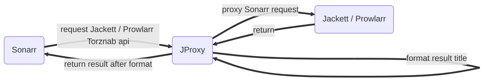

<p align="center">
  <a href="https://github.com/LuckyPuppy514/jproxy">
    
  </a>
</p>
<p align="center">
  <a href="https://github.com/LuckyPuppy514/jproxy"></a>
  <a href="https://github.com/LuckyPuppy514/jproxy"></a>
  <a href="./LICENSE"></a>
</p>

[中文](https://github.com/LuckyPuppy514/jproxy/blob/main/README.zh_CN.md) | [English](https://github.com/LuckyPuppy514/jproxy/blob/main/README.md)

**Table of Contents**

- [Introduce](#introduce)
- [Frame](#frame)
- [Function](#function)
- [Install](#install)
  - [Docker (Recommend)](#docker-recommend)
    - [docker-compose](#docker-compose)
    - [docker run](#docker-run)
    - [Arm Machine: build docker image by yourself](#arm-machine-build-docker-image-by-yourself)
  - [Linux / Windows](#linux--windows)
- [Usage](#usage)
  - [1. Login](#1-login)
  - [2. Setting](#2-setting)
  - [3. Download Rules](#3-download-rules)
  - [4. Sonarr Setting](#4-sonarr-setting)
- [Related Efforts](#related-efforts)
- [Contributing](#contributing)
- [License](#license)

## Introduce

improve recognition rate of Sonarr, especially for anime

**<center>Before</center>**


**<center>After</center>**


## Frame



1. Proxy request to Jackett / Prowlarr of Sonarr
2. Add search key replace rule, so that get more result
3. Add result title format rule, so that Sonarr can recognize the season, episode and language info

## Function
1. Web UI: Chinese or English
2. Proxy Config: Jackett / Prowlarr ip, port setting
3. Add Rule: Include search and result rule
4. Rule Manage: Search, edit, delete, share and import or export
5. Rule Market: Search rules shared by others and download
6. Rule Test: Add title list and check the result after format


## Install

### Docker (Recommend)

#### docker-compose

```
version: "3"
services:
  jproxy:
    image: luckypuppy514/jproxy:latest
    container_name: jproxy
    environment:
      - TZ=Asia/Shanghai
    volumes:
      - /docker/jproxy/config:/app/config
    network_mode: host
    restart: unless-stopped
```

#### docker run

```
docker pull luckypuppy514/jproxy:latest
```
```
docker run --name jproxy \
-v /docker/jproxy/config:/app/config \
--net=host \
-e TZ=Asia/Shanghai \
--restart unless-stopped \
-d luckypuppy514/jproxy
```

#### Arm Machine: build docker image by yourself
1. [Download latest version docker-build-version.zip](https://github.com/LuckyPuppy514/jproxy/releases)  
>
1. Upload docker to your server  
>
2. run docker-build  
```
sh docker-build.sh
```

### Linux / Windows

1. Install jdk1.8
2. [Download latest version](https://github.com/LuckyPuppy514/jproxy/releases)
3. Run startup script

Linux
```
nohup sh startup.sh &
```
Windows
```
startup.bat
```

## Usage
### 1. Login
```
URL: http://ip:8117
USERNAME: jproxy
PASSWORD: jproxy@2022
```


### 2. Setting
Setting Jackett / Prowlarr ip and port


### 3. Download Rules
Download rules from market or add new rule by yourself


### 4. Sonarr Setting
Modify indexer's ip and port to JProxy's ip and port


[See Wiki For Detail](https://github.com/LuckyPuppy514/jproxy/wiki)

## Related Efforts

- [Sonarr](https://github.com/Sonarr/Sonarr) — Smart PVR for newsgroup and bittorrent users
- [Jackett](https://github.com/Jackett/Jackett) — API Support for your favorite torrent trackers
- [Prowlarr](https://github.com/Prowlarr/Prowlarr) — Prowlarr is an indexer manager/proxy
- [Layuimini](https://github.com/zhongshaofa/layuimini) — Admin web template base on layui

## Contributing

Technology Stack
+ layuimini
+ thymeleaf
+ springboot
+ sqlite
+ mybatis-plus
+ knife4j
+ maven

Feel free to dive in！[Open an issue](https://github.com/LuckyPuppy514/Play-With-MPV/issues/new) or submit PRs.

## License

[MIT](https://github.com/LuckyPuppy514/jproxy/blob/main/LICENSE) © LuckyPuppy514
