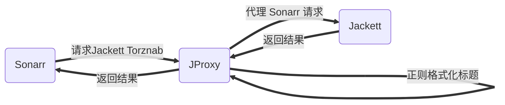

# Jackett 代理

支持的运行环境：docker, linux, windows，推荐：dokcer  

本项目包含以下功能：
> 代理 jackett Torznab 接口，利用正则格式化返回结果中的标题，从而使 sonarr 识别，主要是针对动漫



## 内容列表

- [Jackett 代理](#jackett-代理)
  - [内容列表](#内容列表)
  - [背景](#背景)
  - [安装](#安装)
    - [Docker（推荐）](#docker推荐)
      - [docker-compose](#docker-compose)
      - [docker run](#docker-run)
    - [Linux](#linux)
    - [Windows](#windows)
  - [使用说明](#使用说明)
  - [徽章](#徽章)
  - [相关仓库](#相关仓库)
  - [如何贡献](#如何贡献)
  - [使用许可](#使用许可)

## 背景

Sonarr 对中文识别不友好，很多动漫资源都会出现以下问题，导致无法自动下载：

+ Unknown episode or series
+ 中文识别成英文
+ 其他

原因

+ 各个字幕组的标题格式不同，且与 Sonarr 要求有出入，导致很多出现未知季，未知集
+ Sonarr 对语言的识别也与标题有关，有中文字幕组，或者[简中]等标志，一般才可识别成中文

本项目解决方案

1. 精确匹配
   针对字幕组：单独为每个 Sonarr 无法识别的字幕组，指定对应的正则格式化规则
2. 通用匹配
   针对某些特定字符：单独制定正则规则进行格式化，如：Season => S，第二季 => S2, S0X => SX（Sonarr多个0就不认，QAQ）

> 优先执行精确匹配，执行成功一次则返回  
> 如果执行精确匹配失败，则执行所有通用匹配规则才返回  

## 安装

### Docker（推荐）

如果 jackett 不在同一服务器，或者端口号非 9117，需要手动修改 jackett.url
```
# 进入容器
docker exec -it jproxy /bin/sh
# 编辑配置文件
vi /app/application.yml
```
修改 jackett.url
```
jackett:
  url: http://127.0.0.1:9117
```

#### docker-compose

```
version: "3"
services:
  jproxy:
    image: luckypuppy514/jproxy:latest
    container_name: jproxy
    environment:
      - TZ=Asia/Shanghai
    ports:
      - 8117:8117
    restart: unless-stopped
```

#### docker run

```
docker pull luckypuppy514/jproxy:latest

docker run --name jproxy \
-p 8117:8117 \
--restart unless-stopped \
-d luckypuppy514/jproxy
```

### Linux
[下载最新版本（附带jdk1.8）]()
解压后，修改配置文件：application.yml 中的 jackett.url
```
jackett:
  url: http://127.0.0.1:9117
```

然后执行以下命令启动：
```
sh startup.sh
```

### Windows
1. 自行安装 jdk1.8
2. [下载最新版本]()
3. 修改配置文件：application.yml 中的 jackett.url

```
jackett:
  url: http://127.0.0.1:9117
```

4. 执行以下命令启动
```
java "-Dfile.encoding=utf-8" -jar jproxy.jar
```

## 使用说明
修改 Sonarr => Settings => Indexers 中的 URL 的 IP 和端口号为 JProxy 的 IP 和端口即可
例如：
```
# 修改前
http://192.168.6.1:9117/api/xxx

# 修改后
http://192.168.6.1:8117/api/xxx
```


## 徽章

[](https://github.com/RichardLitt/standard-readme)


## 相关仓库

- [Sonarr](https://github.com/Sonarr/Sonarr) — Smart PVR for newsgroup and bittorrent users
- [Jackett](https://github.com/Jackett/Jackett) — API Support for your favorite torrent trackers


## 如何贡献

非常欢迎你的加入！[提一个 Issue](https://github.com/LuckyPuppy514/Play-With-MPV/issues/new) 或者提交一个 Pull Request。


## 使用许可

[MIT](https://github.com/LuckyPuppy514/Play-With-MPV/blob/main/LICENSE) © LuckyPuppy514