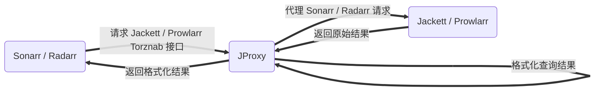

<p align="center">
  <a href="https://github.com/LuckyPuppy514/jproxy">
    
  </a>
</p>
<p align="center">
  <a href="https://github.com/LuckyPuppy514/jproxy"></a>
  <a href="https://github.com/LuckyPuppy514/jproxy"></a>
  <a href="./LICENSE"></a>
</p>

[中文](https://github.com/LuckyPuppy514/jproxy/blob/main/README.md) | [English](https://github.com/LuckyPuppy514/jproxy/blob/main/README.en_US.md)

- [🌟 项目简介](#-项目简介)
- [🧱 项目安装](#-项目安装)
  - [Docker](#docker)
  - [Windows](#windows)
- [☃️ 基础配置](#️-基础配置)
- [😘 如何贡献](#-如何贡献)
- [👏 相关仓库](#-相关仓库)
- [🃏 使用许可](#-使用许可)

## 🌟 项目简介

介于 `Sonarr / Radarr` 和 `Jackett / Prowlarr` 之间的代理，主要用于优化查询和提升识别率




## 🧱 项目安装

### Docker

```text
version: '3.0'
services:
   jproxy:
      image: luckypuppy514/jproxy:latest
      container_name: jproxy
      restart: unless-stopped
      environment:
      - PUID=1000
      - PGID=1000
      - TZ=Asia/Shanghai
      - REDIS_HOST=jproxy-redis
      - REDIS_PORT=6379
      - JAVA_OPTS=-Xms512m -Xmx512m
      links:
      - jproxy-redis
      ports:
      - 8117:8117
      volumes:
      - /docker/jproxy/database:/app/database

   jproxy-redis:
      image: redis:latest
      container_name: jproxy-redis
      restart: unless-stopped
```

如需使用 `docker run` 进行部署，请参考 [docker-run.sh](https://github.com/LuckyPuppy514/jproxy/blob/main/docker/docker-run.sh)

|     参数名     |  默认值   |           说明            |
| :------------: | :-------: | :-----------------------: |
|      PUID      |     0     |          用户 ID          |
|      PGID      |     0     |           组 ID           |
|   REDIS_HOST   | 127.0.0.1 |      Redis 主机地址       |
|   REDIS_PORT   |   6379    |       Redis 端口号        |
|   JAVA_OPTS    |     -     | 建议值: -Xms512m -Xmx512m |
| REDIS_PASSWORD |     -     |        Redis 密码         |
| REDIS_DATABASE |     0     |      Redis database       |

### Windows

1. [下载 jdk17](https://kutt.lckp.top/yrnerc)，安装并配置好环境变量
2. [下载 windows.zip](https://github.com/LuckyPuppy514/jproxy/releases) ，解压到安装目录

|    文件名    |     说明      |       备注       |
| :----------: | :-----------: | :--------------: |
| startup.bat  |   启动脚本    |        -         |
| shutdown.bat |   关闭脚本    |        -         |
| startup.vbs  | 后台启动脚本  | 隐藏窗口后台运行 |
|   database   |    数据库     | 升级请保留数据库 |
|    config    |   配置文件    |        -         |
|  jproxy.jar  | 可执行 jar 包 |        -         |
|    redis     | redis 数据库  |        -         |

## ☃️ 基础配置

- 地址：`http://127.0.0.1:8117/login`
- 用户：`jproxy`
- 密码：`jproxy@2023`


① 在 `系统配置 - 基础配置` 中填写 `Sonarr 服务地址` 和 `API 密钥`，以及 `索引器地址`（Jackett / Prowlarr 二选一即可）


💡 保存后，正常应如下图所示 ✅ ，否则请检查输入和网络连通性


② 首次使用，建议手动同步一次 `剧集标题` 和 `剧集规则`（后续会自动同步）


③ 在 `Sonarr - Indexers` 中，修改索引器 `URL` 的 `IP` 和 `端口号` 为 JProxy 的 `IP` 和 `端口号`，并追加路径 `/sonarr/jackett`（Prowlarr 则追加 `/sonarr/prowlarr`）
  
`http://192.168.6.15:9117/api/v2.0/......` ➡️ `http://192.168.6.14:8117/sonarr/jackett/api/v2.0/......`
  


💡 建议先修改一个，确认正常后再修改其他的索引器配置


[🎗️ 进阶配置和使用说明请查看 Wiki](https://github.com/LuckyPuppy514/jproxy/wiki)

## 😘 如何贡献

非常欢迎你的加入！[提一个 Issue](https://github.com/LuckyPuppy514/jproxy/issues/new/choose) 或者提交一个 Pull Request

- [arco-design-pro-vue](https://github.com/arco-design/arco-design-pro-vue)
- [spring-boot](https://github.com/spring-projects/spring-boot)
- [sqlite](https://github.com/sqlite/sqlite)
- [liquibase](https://github.com/liquibase/liquibase)
- [mybatis](https://github.com/mybatis/mybatis-3)
- [mybatis-plus](https://github.com/baomidou/mybatis-plus)
- [redis](https://github.com/redis/redis)
- [knife4j](https://github.com/xiaoymin/knife4j)
- [charon](https://github.com/mkopylec/charon-spring-boot-starter)
- [jib](https://github.com/GoogleContainerTools/jib)

## 👏 相关仓库

- [Sonarr](https://github.com/Sonarr/Sonarr)
- [Radarr](https://github.com/radarr/radarr)
- [Jackett](https://github.com/Jackett/Jackett)
- [Prowlarr](https://github.com/Prowlarr/Prowlarr)
- [qBittorrent](https://github.com/qbittorrent/qBittorrent)

## 🃏 使用许可

[MIT](https://github.com/LuckyPuppy514/jproxy/blob/main/LICENSE) © LuckyPuppy514
