<p align="center">
  <a href="https://github.com/LuckyPuppy514/jproxy">
    
  </a>
</p>
<p align="center">
  <a href="https://github.com/LuckyPuppy514/jproxy"></a>
  <a href="https://github.com/LuckyPuppy514/jproxy"></a>
  <a href="https://github.com/LuckyPuppy514/jproxy/blob/main/LICENSE.txt"></a>
</p>

<div align="center">
  简体中文 | <a href="https://github.com/LuckyPuppy514/jproxy/blob/main/README.en_US.md">English</a>
</div>

- [🌟 项目简介](#-项目简介)
- [🧱 项目安装](#-项目安装)
  - [Docker](#docker)
  - [Windows](#windows)
- [☃️ 基础配置](#️-基础配置)
- [😘 如何贡献](#-如何贡献)
- [👏 相关仓库](#-相关仓库)
- [🃏 使用许可](#-使用许可)

## 🌟 项目简介

介于 `Sonarr / Radarr` 和 `Jackett / Prowlarr` 之间的代理，主要用于优化查询和提升识别率

```mermaid
graph LR
    1[Sonarr / Radarr] == 请求 Jackett / Prowlarr Torznab 接口 ==> 2(JProxy) == 代理 Sonarr / Radarr 请求 ==> 3(Jackett / Prowlarr) 

    3(Jackett / Prowlarr) == 返回原始结果 ==> 2(JProxy) == 返回格式化结果 ==> 1(Sonarr / Radarr)
    
    2(JProxy) == 优化查询关键字 ==> 2(JProxy)
    2(JProxy) == 格式化查询结果 ==> 2(JProxy)
```




## 🧱 项目安装

### Docker

```text
version: '3.0'
services:
   jproxy:
      image: luckypuppy514/jproxy:latest
      container_name: jproxy
      restart: unless-stopped
      environment:
      - PUID=1000
      - PGID=1000
      - TZ=Asia/Shanghai
      - JAVA_OPTS=-Xms512m -Xmx512m
      ports:
      - 8117:8117
      volumes:
      - /docker/jproxy/database:/app/database
```

如需使用 `docker run` 进行部署，请参考 [docker-run.sh](https://github.com/LuckyPuppy514/jproxy/blob/main/docker/docker-run.sh)

|            参数名            |      默认值       |                           说明                           |
| :--------------------------: | :---------------: | :------------------------------------------------------: |
|             PUID             |         0         |                         用户 ID                          |
|             PGID             |         0         |                          组 ID                           |
|              TZ              |   Asia/Shanghai   |                           时区                           |
|          JAVA_OPTS           | -Xms512m -Xmx512m |                       JVM 运行参数                       |
|        CACHE_EXPIRES         |       4320        |                   缓存过期时间（分钟）                   |
|        TOKEN_EXPIRES         |       10080       |                   登录过期时间（分钟）                   |
|        SYNC_INTERVAL         |         3         |                     同步间隔（分钟）                     |
|         RENAME_FILE          |       true        |               文件重命名开关（true/false）               |
|          MIN_COUNT           |         6         | 当结果数量少于该值时，会追加主标题（去除季数和集数）搜索 |
| INDEXER_RESULT_CACHE_EXPIRES |        15         |              索引器结果缓存过期时间（分钟）              |

如需设置代理，可在 `JAVA_OPTS` 添加对应的代理参数

- HTTP 代理
  `-Xms512m -Xmx512m -Dhttp.proxyHost=192.168.6.2 -Dhttp.proxyPort=12345`
- SOCKS 代理
  `-Xms512m -Xmx512m -DsocksProxyHost=192.168.6.2 -DsocksProxyPort=54321`

### Windows

1. [下载 jdk17](https://kutt.lckp.top/yrnerc)，安装并配置好环境变量
2. [下载 windows.zip](https://github.com/LuckyPuppy514/jproxy/releases) ，解压到安装目录

|       文件名       |     说明      |       备注       |
| :----------------: | :-----------: | :--------------: |
|    startup.bat     |   启动脚本    |        -         |
|    shutdown.bat    |   关闭脚本    |        -         |
| startup-daemon.bat | 后台启动脚本  | 隐藏窗口后台运行 |
|      database      |    数据库     | 升级请保留数据库 |
|       config       |   配置文件    |        -         |
|     jproxy.jar     | 可执行 jar 包 |        -         |

## ☃️ 基础配置

- 地址：`http://127.0.0.1:8117/login`
- 用户：`jproxy`
- 密码：`jproxy@2023`


① 在 `系统配置 - 基础配置` 中填写 `Sonarr 服务地址` 和 `API 密钥`，以及 `索引器地址`（Jackett / Prowlarr 二选一即可）


💡 保存后，正常应如下图所示 ✅ ，否则请检查输入和网络连通性


② 首次使用，建议手动同步一次 `剧集标题` 和 `剧集规则`（后续会自动同步）


③ 修改索引器地址的 `IP` 和 `端口号` 为 JProxy 的 `IP` 和 `端口号`，并追加相应路径

Jackett

`http://192.168.6.15:9117/api/v2.0/......` ➡️ `http://192.168.6.14:8117/sonarr/jackett/api/v2.0/......`


Prowlarr

`http://192.168.6.15:9696` ➡️ `http://192.168.6.14:8117/sonarr/prowlarr`


并关闭本地安全认证


[🎗️ 进阶配置和使用说明请查看 Wiki](https://github.com/LuckyPuppy514/jproxy/wiki)

## 😘 如何贡献

非常欢迎你的加入！[提一个 Issue](https://github.com/LuckyPuppy514/jproxy/issues/new/choose) 或者提交一个 Pull Request

- [arco-design-pro-vue](https://github.com/arco-design/arco-design-pro-vue)
- [spring-boot](https://github.com/spring-projects/spring-boot)
- [sqlite](https://github.com/sqlite/sqlite)
- [liquibase](https://github.com/liquibase/liquibase)
- [mybatis](https://github.com/mybatis/mybatis-3)
- [mybatis-plus](https://github.com/baomidou/mybatis-plus)
- [caffeine](https://github.com/ben-manes/caffeine)
- [knife4j](https://github.com/xiaoymin/knife4j)
- [charon](https://github.com/mkopylec/charon-spring-boot-starter)
- [jib](https://github.com/GoogleContainerTools/jib)

## 👏 相关仓库

- [Sonarr](https://github.com/Sonarr/Sonarr)
- [Radarr](https://github.com/radarr/radarr)
- [Jackett](https://github.com/Jackett/Jackett)
- [Prowlarr](https://github.com/Prowlarr/Prowlarr)
- [qBittorrent](https://github.com/qbittorrent/qBittorrent)

## 🃏 使用许可

[MIT](https://github.com/LuckyPuppy514/jproxy/blob/main/LICENSE) © LuckyPuppy514
