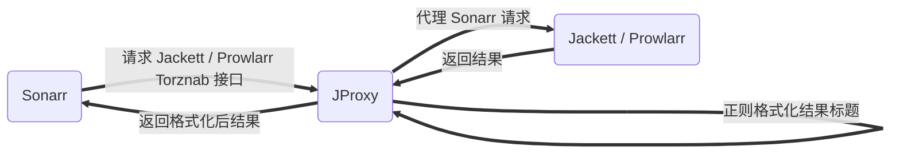

<p align="center">
  <a href="https://github.com/LuckyPuppy514/jproxy">
    
  </a>
</p>
<p align="center">
  <a href="https://github.com/LuckyPuppy514/jproxy"></a>
  <a href="https://github.com/LuckyPuppy514/jproxy"></a>
  <a href="./LICENSE"></a>
</p>

[中文](https://github.com/LuckyPuppy514/jproxy/blob/main/README.zh_CN.md) | [English](https://github.com/LuckyPuppy514/jproxy/blob/main/README.md)

**目录**

- [简介](#简介)
- [实现](#实现)
- [功能](#功能)
- [安装](#安装)
  - [Docker（推荐）](#docker推荐)
    - [docker-compose](#docker-compose)
    - [docker run](#docker-run)
    - [Arm 机器：可以自行 build docker 镜像](#arm-机器可以自行-build-docker-镜像)
  - [Linux / Windows](#linux--windows)
- [使用](#使用)
  - [1. 登录](#1-登录)
  - [2. 配置](#2-配置)
  - [3. 下载规则](#3-下载规则)
  - [4. Sonarr 配置](#4-sonarr-配置)
- [相关仓库](#相关仓库)
- [如何贡献](#如何贡献)
- [使用许可](#使用许可)

## 简介

优化 Sonarr 对资源的识别率，主要是针对动漫

**<center>使用前</center>**


**<center>使用后</center>**


## 实现



1. 代理 Sonarr 对 Jackett / Prowlarr 的请求
2. 添加查询关键字替换规则，从而使 Sonarr 能够查询到更多结果
3. 添加结果标题格式化正则，从而使 Sonarr 能够正确识别季，集，语言等信息

## 功能
1. 简单界面：支持中文和英文
2. 代理配置：配置 Jackett / Prowlarr 的地址，端口等信息
3. 新增规则：包括查询规则和结果规则
4. 规则管理：查询，编辑，删除，分享，以及导入导出等
5. 规则市场：可以查询大家分享的规则，并下载
6. 用例测试：可以批量添加标题进行测试，查看格式化后的效果


## 安装

### Docker（推荐）

#### docker-compose

```
version: "3"
services:
  jproxy:
    image: luckypuppy514/jproxy:latest
    container_name: jproxy
    environment:
      - TZ=Asia/Shanghai
    volumes:
      - /docker/jproxy/config:/app/config
    network_mode: host
    restart: unless-stopped
```

#### docker run

```
docker pull luckypuppy514/jproxy:latest
```
```
docker run --name jproxy \
-v /docker/jproxy/config:/app/config \
--net=host \
-e TZ=Asia/Shanghai \
--restart unless-stopped \
-d luckypuppy514/jproxy
```

#### Arm 机器：可以自行 build docker 镜像
1. [下载最新版源码](https://github.com/LuckyPuppy514/jproxy/releases)  
>
2. 上传以下目录到服务器  
```
release/docker
``` 

3. 执行 docker-build 命令  
```
sh docker-build.sh
```

### Linux / Windows

1. 自行安装 jdk1.8
2. [下载最新版本](https://github.com/LuckyPuppy514/jproxy/releases)
3. 执行启动命令

Linux
```
nohup sh startup.sh &
```
Windows
```
startup.bat
```

## 使用
### 1. 登录
```
地址: http://ip:8117
用户: jproxy
密码: jproxy@2022
```


### 2. 配置
配置 Jackett / Prowlarr 的 IP 和端口号


### 3. 下载规则
从市场下载规则或者自行新增规则


### 4. Sonarr 配置
修改 Indexer 的 IP 和端口号为 JProxy 的 IP 和端口号


[详细使用说明见 Wiki](https://github.com/LuckyPuppy514/jproxy/wiki)

## 相关仓库

- [Sonarr](https://github.com/Sonarr/Sonarr) — Smart PVR for newsgroup and bittorrent users
- [Jackett](https://github.com/Jackett/Jackett) — API Support for your favorite torrent trackers
- [Prowlarr](https://github.com/Prowlarr/Prowlarr) — Prowlarr is an indexer manager/proxy
- [Layuimini](https://github.com/zhongshaofa/layuimini) — 基于 layui 后台admin前端模板

## 如何贡献

技术栈
+ layuimini
+ thymeleaf
+ springboot
+ sqlite
+ mybatis-plus
+ knife4j
+ maven

非常欢迎你的加入！[提一个 Issue](https://github.com/LuckyPuppy514/Play-With-MPV/issues/new) 或者提交一个 Pull Request。

## 使用许可

[MIT](https://github.com/LuckyPuppy514/jproxy/blob/main/LICENSE) © LuckyPuppy514
