<p align="center">
  <a href="https://github.com/LuckyPuppy514/jproxy">
    
  </a>
</p>
<p align="center">
  <a href="https://github.com/LuckyPuppy514/jproxy"></a>
  <a href="https://github.com/LuckyPuppy514/jproxy"></a>
  <a href="./LICENSE"></a>
</p>

[中文](https://github.com/LuckyPuppy514/jproxy/blob/main/README.zh_CN.md) | [English](https://github.com/LuckyPuppy514/jproxy/blob/main/README.md)

- [🐳 简介](#-简介)
- [👻 实现](#-实现)
- [❄️ 功能](#️-功能)
- [😊 安装](#-安装)
  - [🐳 Docker（推荐）](#-docker推荐)
    - [docker-compose](#docker-compose)
    - [docker run](#docker-run)
  - [🪟 Linux / Windows](#-linux--windows)
- [☃️ 使用](#️-使用)
  - [1. 登录](#1-登录)
  - [2. 配置](#2-配置)
  - [3. 下载规则](#3-下载规则)
  - [4. Sonarr 配置](#4-sonarr-配置)
- [👏 相关仓库](#-相关仓库)
- [😘 如何贡献](#-如何贡献)
- [🃏 使用许可](#-使用许可)

## 🐳 简介

优化 Sonarr 对资源的识别率，主要是针对动漫

**使用前**


**使用后**


## 👻 实现

```mermaid
graph LR
    1[Sonarr] == 请求 Jackett / Prowlarr Torznab 接口 ==> 2(JProxy) == 代理 Sonarr 请求 ==> 3(Jackett / Prowlarr) 

    3(Jackett / Prowlarr) == 返回结果 ==> 2(JProxy) == 返回格式化后结果 ==> 1(Sonarr)
    
    2(JProxy) == 替换查询关键字 ==> 2(JProxy)
    2(JProxy) == 正则格式化结果标题 ==> 2(JProxy)
```



1. 代理 Sonarr 对 Jackett / Prowlarr 的请求
2. 添加查询关键字替换规则，从而使 Sonarr 能够查询到更多结果
3. 添加结果标题格式化正则，从而使 Sonarr 能够正确识别季，集，语言等信息

## ❄️ 功能

1. 简单界面：支持中文和英文
2. 代理配置：配置 Jackett / Prowlarr 的地址，端口等信息
3. 新增规则：包括查询规则和结果规则
4. 规则管理：查询，编辑，删除，分享，以及导入导出等
5. 规则市场：可以查询大家分享的规则，并下载
6. 用例测试：可以批量添加标题进行测试，查看格式化后的效果


## 😊 安装

### 🐳 Docker（推荐）

#### docker-compose

```text
version: "3"
services:
  jproxy:
    image: luckypuppy514/jproxy:latest
    container_name: jproxy
    environment:
      - TZ=Asia/Shanghai
      - "JAVA_OPTS=-Xms256m -Xmx256m"
    volumes:
      - /docker/jproxy/config:/app/config
    network_mode: host
    restart: unless-stopped
```

#### docker run

```bash
docker pull luckypuppy514/jproxy:latest
```

```bash
docker run --name jproxy \
-v /docker/jproxy/config:/app/config \
-e TZ=Asia/Shanghai \
-e "JAVA_OPTS=-Xms256m -Xmx256m" \
--net=host \
--restart unless-stopped \
-d luckypuppy514/jproxy:latest
```

> 🔥arm64v8: luckypuppy514/jproxy:arm64v8-latest

### 🪟 Linux / Windows

1. 自行安装 jdk1.8
   >
2. 下载最新版本：[linux.windows-version.zip](https://github.com/LuckyPuppy514/jproxy/releases)
   >
3. 执行启动命令

Linux

```bash
nohup sh startup.sh &
```

Windows

```bat
startup.bat
```

## ☃️ 使用

### 1. 登录

```text
地址: http://ip:8117
用户: jproxy
密码: jproxy@2022
```


### 2. 配置

配置 Jackett / Prowlarr 以及 qBittorrent 的 IP 和端口号


### 3. 下载规则

从市场下载规则，推荐先下载我的规则【备注：@LuckyPuppy514】，其他规则按需下载


### 4. Sonarr 配置

修改 Indexer 的 IP 和端口号为 JProxy 的 IP，端口号以及路径

```text
# 原来的
http://192.168.6.9:9117/api/v2.0/...
http://192.168.6.9:9696/...

# jackett
http://192.168.6.9:8117/jackett/api/v2.0/...
# prowlarr
http://192.168.6.9:8117/prowlarr/...
```


修改 qBittorrent 的 IP 和端口号为 JProxy 的 IP，端口号以及路径

```text
# 原来的
Host: 192.168.6.9
Port: 8080
Url Base: 

# jproxy
Host: 192.168.6.9
Port: 8117
Url Base: /qbittorrent
```


[详细使用说明见 Wiki](https://github.com/LuckyPuppy514/jproxy/wiki)

## 👏 相关仓库

- [Sonarr](https://github.com/Sonarr/Sonarr) — Smart PVR for newsgroup and bittorrent users
- [Jackett](https://github.com/Jackett/Jackett) — API Support for your favorite torrent trackers
- [Prowlarr](https://github.com/Prowlarr/Prowlarr) — Prowlarr is an indexer manager/proxy
- [Layuimini](https://github.com/zhongshaofa/layuimini) — 基于 layui 后台admin前端模板

## 😘 如何贡献

技术栈

- layuimini
- thymeleaf
- springboot
- sqlite
- mybatis-plus
- knife4j
- maven

非常欢迎你的加入！[提一个 Issue](https://github.com/LuckyPuppy514/Play-With-MPV/issues/new) 或者提交一个 Pull Request。

## 🃏 使用许可

[MIT](https://github.com/LuckyPuppy514/jproxy/blob/main/LICENSE) © LuckyPuppy514
